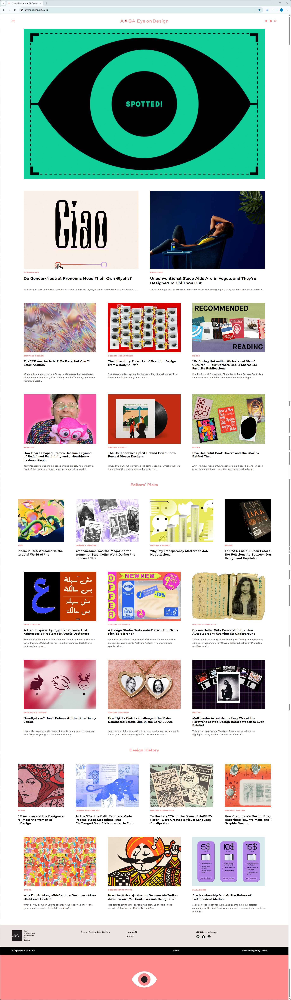
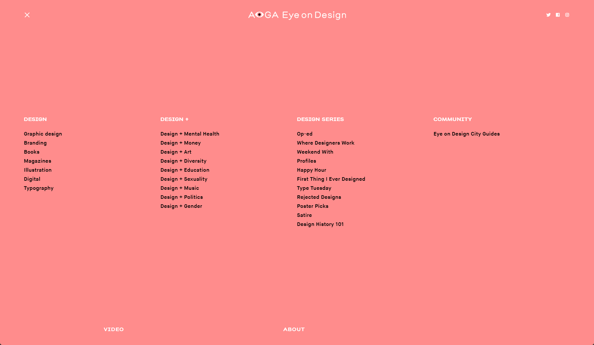
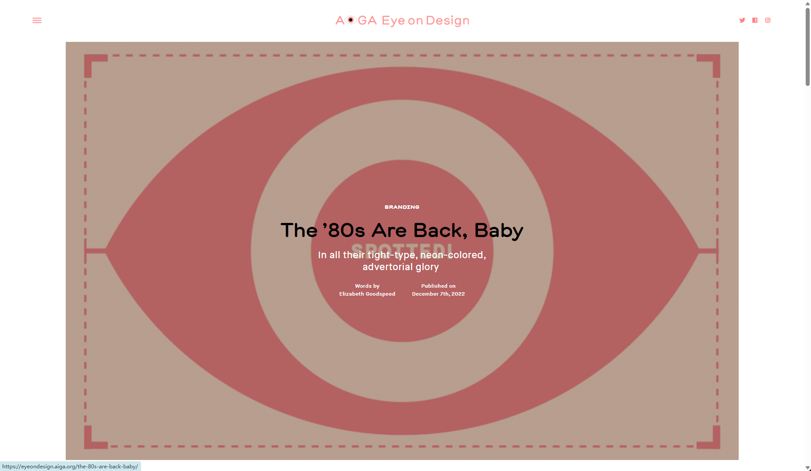
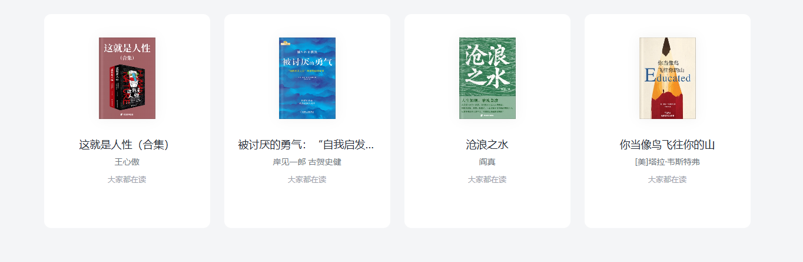
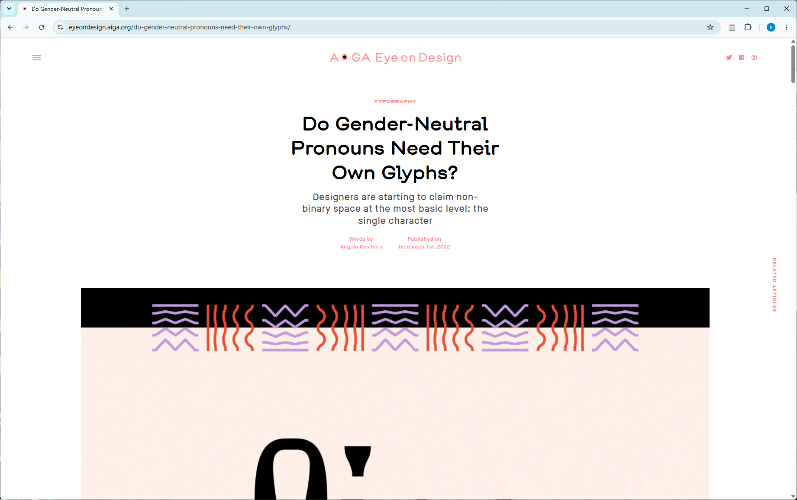
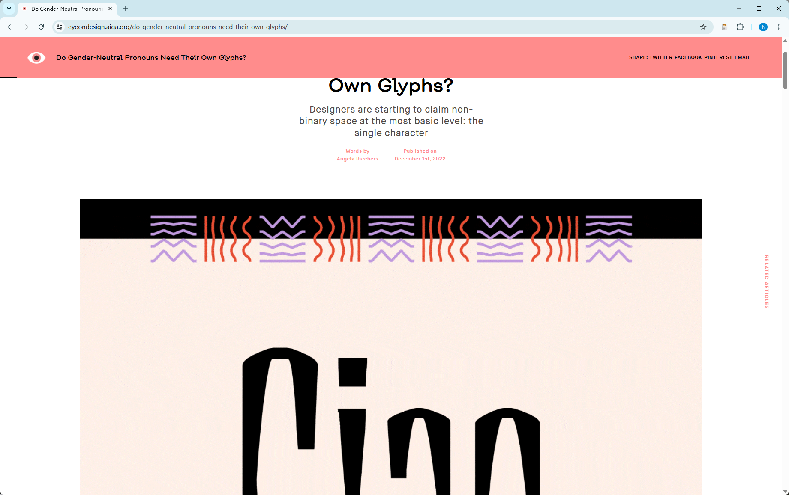
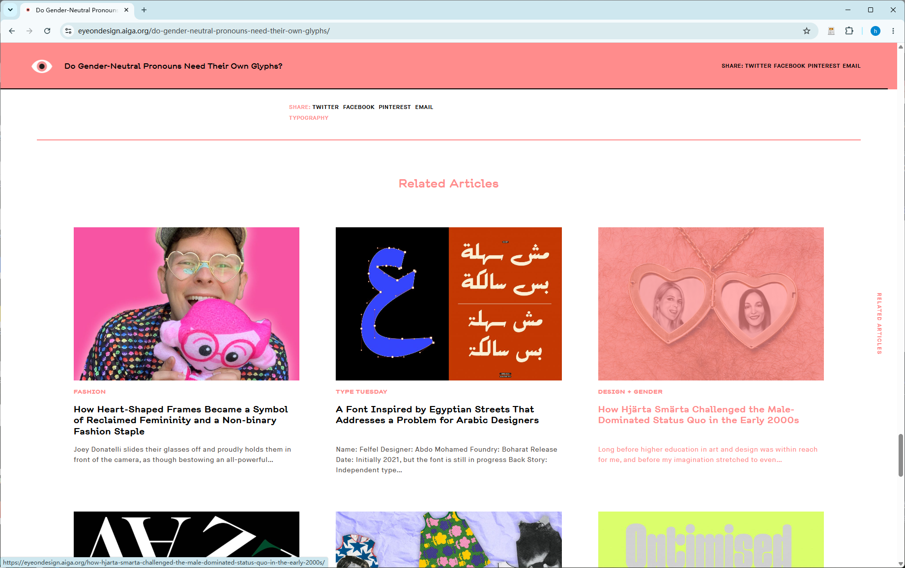
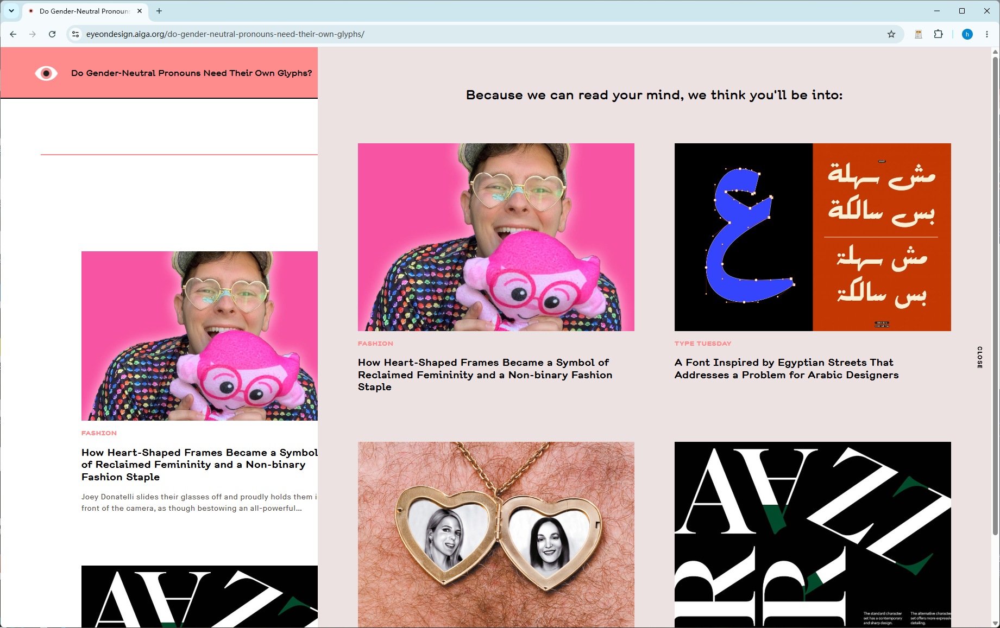
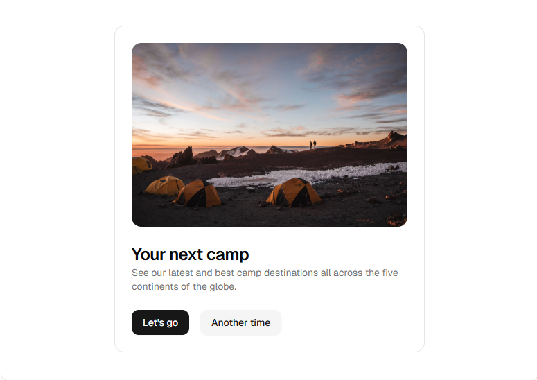

# Aether 前端UI开发文档

**仅为我的想法，你进行优化补充，保存新的方案在UI-Plan.md下**

## 技术选型

你选择，基于下面要用的组件我个人建议使用Next.js

## LOGO

根据本项目的特点生成logo

web图片的、文字的、js动画的

web图片生成prompt即可我是用comfyui生成图片

文字logo：使用js还是其他技术生成一个可嵌入网站的文字logo，最好是带动画（文字是：Aether）

js动画，是与项目相关与其他logo有关，一般是用于加载loading动画

等等，有可能用到的都生成，生成不了的说明文件类型=给出prompt

## 网页UI

> 网页UI整体风格参考：https://eyeondesign.aiga.org/ （实在不确定ui编码时可进行爬虫爬取）
>
> 主体色调、文字风格可以更具项目风格更换，可以先生成一个简单的HTML文件，供我确认
>
> UI-Plan中要有具体的样式代码参考
>
> 有light 和 night两种主题模式
>
> 所有系统文字有中文简体和英文两个版本
>
> 有完整的面包屑功能

以下皆为风格参考，具体的内容以本项目为主

### Robot协议

不允许爬取任何东西（内容、样式等等）

### 主页



这是参考网站的主页（长截图版），主要板块（由上至下）

- 上方的导航按钮（左上角那三条杠），点击后展示所有导航（实例如下图为点击后的效果），应用与本项目就可以放文章导航等等

  

- 右上角可以放跳转至管理端（及用户登录，是令打开一个网页）、订阅（点击订阅屏幕中央显示填写邮箱，对同一个IP可以显示已提交的邮箱，一个IP可以提交多个邮箱，邮箱提交成功后提示用户问卷（用户可以选择跳过不填写），一个IP只能填写一份问卷，但支持修改且只能修改2次）等（参考网站放的是推特等网站）、项目GitHub地址等

- Hero区，一张大的LOGO样式的区域，鼠标悬浮至时显示项目相关信息（参考网站参考图如下）

  

- 接着Hero区的是公告区，顺时针轮播最近的3-5条公告（动态，新闻等等），参考网站中没有相关实例，可根据参考网站风格自行发挥，有一些高技术的东西最好没有也行

- 紧接着的是热门文章，鼠标未选中时如上述的长截图中所示，当鼠标悬浮至相应文章上时，对应的内容渲染为另一套主体色（如参考图所示），另外文章可以自定义热度文章（后端可进行排序），展示可以多展示几个6-10个左右，不要显示创建时间

- 下面紧接的是推荐的小说书本，参考图(封面（微微缩小）、书名、作者、一句话介绍或分类和标签（选择一个合适的）)，鼠标悬浮动画和上述的文章一致，下面的图集，音乐也同理

  

- 下面依次是推荐图集，3-4个；推荐音乐、专辑，3-4个；

- 最后版权，版权下面是一个logo图，logo是随着鼠标滚动慢慢展示出来的（特别，像参考网站的logo是眼睛，展开时，有由闭眼到睁眼的动画，如果本项目也有类似的也设计相关的动画）

### 文章详情

文章详情的统一格式，除了内容外的其他格式

- 点击文章详情（参考图）

  

- 当鼠标向上滚动（滚动整个页面的5%-8%之间），网站最上面就显示文章的题目等信息如参考图

  

- 整个网站的鼠标选择事件的效果是一样的，如图为文章中：其他文章推荐

  

- 其他文章推荐：一篇文章的最后显示以及始终在文章（网页最右侧，上述图中右侧的RELATED ARTICLES），文章右侧的是个只显示文字的透明按钮，点击即可打开侧边栏展示其他文章，如图

  

  右侧的按钮（也可以不是按钮，是一个文字卡片），可以参考使用附录中组件：`Text 3D Flip`，当鼠标划过时出发动画；可以是`Morphing Text`，使得文字一直在（其他文章和RELATED ARTICLES）中变化

### 管理端（登录）

上述的主页右上角的`跳转至管理端（及用户登录，是令打开一个网页）`，路由地址为`aether/cryptex`，管理端的主题风格参考用户端的，功能就是正常的增删改查，只不过因材施艺，例如图片、视频上传时有本地和云端两套，在页面要能体现出来、文章内容编辑时有可以有多种编辑模式，如html、md、latex等等，并且带有预览功能等等不同功能有不同方案

- 默认有权限校验，校验通过进入管理端，不通过路由至登录页`aether/cryptex/login`，背景是文字浪（有波浪效果），最中间提示输入`cryptex`，（也就是密码），密码默认为`heyqing2aether`
- 有log界面
- 用户地区分布（在地图上显示，一个地区的人数越多颜色越重，ECharts等组建）

### 图片、图集

> 组建网站：https://magicui.design/docs/components
>
> 仅仅时功能、部分样式等，色调等还是跟随项目

- 图集：封面、题目、简介，参考图（鼠标悬浮至封面图上时，有放大镜意义的功能，去除下面的Let's go和Another time按钮，点击卡片直接跳转至相应的图集详情页）

  

  > 组件网址：https://magicui.design/docs/components/lens
  >
  > 下载安装：pnpm dlx shadcn@latest add @magicui/lens 或 npx shadcn@latest add @magicui/lens

  实例代码

  ```tsx
  "use client"
  
  import { Button } from "@/components/ui/button"
  import {
    Card,
    CardContent,
    CardDescription,
    CardFooter,
    CardHeader,
    CardTitle,
  } from "@/components/ui/card"
  import { Lens } from "@/registry/magicui/lens"
  
  export function LensDemo() {
    return (
      <Card className="relative max-w-md shadow-none">
        <CardHeader>
          <Lens
            zoomFactor={2}
            lensSize={150}
            isStatic={false}
            ariaLabel="Zoom Area"
          >
            
          </Lens>
        </CardHeader>
        <CardContent>
          <CardTitle className="text-2xl">Your next camp</CardTitle>
          <CardDescription>
            See our latest and best camp destinations all across the five
            continents of the globe.
          </CardDescription>
        </CardContent>
        <CardFooter className="space-x-4">
          <Button>Let&apos;s go</Button>
          <Button variant="secondary">Another time</Button>
        </CardFooter>
      </Card>
    )
  }
  ```

- 图集中图片（点击可以进行预览，不可以下载）**网站中的图片、视频等不能下载，在传输时后端不要直接返回链接，用技术手段，反正不能直接给url**（悬浮上时显示图片信息，图片参数信息（必选）：大小等等，这些是可选：题目、介绍等等）

  图集的主题框架可以使用这个组件

  > npx shadcn@latest add @magicui/blur-fade

  ```tsx
  import { BlurFade } from "@/registry/magicui/blur-fade"
  
  const images = Array.from({ length: 9 }, (_, i) => {
    const isLandscape = i % 2 === 0
    const width = isLandscape ? 800 : 600
    const height = isLandscape ? 600 : 800
    return `https://picsum.photos/seed/${i + 1}/${width}/${height}`
  })
  
  export function BlurFadeDemo() {
    return (
      <section id="photos">
        <div className="columns-2 gap-4 sm:columns-3">
          {images.map((imageUrl, idx) => (
            <BlurFade key={imageUrl} delay={0.25 + idx * 0.05} inView>
              
            </BlurFade>
          ))}
        </div>
      </section>
    )
  }
  ```

  但是图片加载时可以使用`pixel-image`组件进行懒加载图片

### 音乐

有自建的收藏夹、专辑、单曲等多种，音乐也不能下载

播放有两种：详情页、悬浮窗

详情页就和普通的详情页一样：有歌曲封面、歌手、歌词、歌词进度、音量等

不同的是多一个根据ai定制的特效（其实就是js、css等样式）

悬浮窗：这在AI助手中，点击AI助手可在小页面中暂停和播放以及退出等多种功能

### 书籍

书籍详情和正常的读书软件差不多，只不过多一个，第二页（书封面为第一页）为一个版权声明，声明自己的还是他人的等等具体你写

### AI助手

对接云端大模型，可以在管理端取消显示、更换大模型厂商等

为一个悬浮窗，图标就是项目LOGO，默认是隐藏的（后端打开的状态下），`CTRL + 空格`唤醒，唤醒状态`CTRL + 空格`隐藏,长时间（5分钟左右）为适应隐藏至侧边（留一点点可以点击打开）

## 附录

以下组件可使用，尽力用到（但不要硬塞）

1. 主题颜色组件

   > 下载：npx shadcn@latest add @magicui/animated-theme-toggler
   >
   > Animated theme toggle using the View Transitions API with configurable clip-path shapes and origin.

   实例代码

   ```tsx
   import { AnimatedThemeToggler } from "@/registry/magicui/animated-theme-toggler"
   
   export function AnimatedThemeTogglerDemo() {
     return (
       <div className="flex justify-center p-6">
         <AnimatedThemeToggler />
       </div>
     )
   }
   ```

2. 文字动画

   > npx shadcn@latest add @magicui/morphing-text
   >
   > A dynamic text morphing component for Magic UI.

   ```tsx
   import { MorphingText } from "@/registry/magicui/morphing-text"
   
   const texts = [
     "Hello",
     "Morphing",
     "Text",
     "Animation",
     "React",
     "Component",
     "Smooth",
     "Transition",
     "Engaging",
   ]
   
   export function MorphingTextDemo() {
     return <MorphingText texts={texts} />
   }
   
   ```

   > npx shadcn@latest add @magicui/highlighter
   >
   > A text highlighter that mimics the effect of a human-drawn marker stroke.

   ```tsx
   import { Highlighter } from "@/registry/magicui/highlighter"
   
   export function HighlighterDemo() {
     return (
       <div className="text-center">
         <p className="leading-relaxed">
           The{" "}
           <Highlighter action="underline" color="#FF9800">
             Magic UI Highlighter
           </Highlighter>{" "}
           makes important{" "}
           <Highlighter action="highlight" color="#87CEFA">
             text stand out
           </Highlighter>{" "}
           effortlessly.
         </p>
       </div>
     )
   }
   ```

   > npx shadcn@latest add @magicui/text-3d-flip
   >
   > A text effect that flips each letter in 3D with a staggered animation on hover.

   ```tsx
   import Text3DFlip from "@/registry/magicui/text-3d-flip"
   
   export function Text3DFlipDemo() {
     return (
       <Text3DFlip
         className="bg-background font-serif text-2xl sm:text-5xl md:text-[56px]"
         textClassName="bg-background text-foreground"
         flipTextClassName="bg-background text-foreground"
         rotateDirection="top"
         staggerDuration={0.03}
         staggerFrom="first"
         transition={{ type: "spring", damping: 25, stiffness: 160 }}
       >
         Stay hungry, stay foolish
       </Text3DFlip>
     )
   }
   ```

   > npx shadcn@latest add @magicui/kinetic-text
   >
   > A text component that animates font weight of characters on hover.

   ```tsx
   import { KineticText } from "@/registry/magicui/kinetic-text"
   
   export function KineticTextDemo() {
     return (
       <div className="relative justify-center">
         <KineticText
           text="Nostalgia"
           className="text-[6rem] tracking-[-5%] [font-optical-sizing:auto]"
         />
       </div>
     )
   }
   ```

   > npx shadcn@latest add @magicui/comic-text
   >
   > Comic text animation that looks like a comic book text

   ```tsx
   import { ComicText } from "@/registry/magicui/comic-text"
   
   export function ComicTextDemo() {
     return (
       <div className="space-y-8 text-center">
         <ComicText fontSize={5}>BOOM!</ComicText>
       </div>
     )
   }
   ```

   

3. 按钮

   > npx shadcn@latest add @magicui/cool-mode
   >
   > Cool mode effect for buttons, links, and other DOMs

   ```tsx
   import { Button } from "@/components/ui/button"
   import { CoolMode } from "@/registry/magicui/cool-mode"
   
   export function CoolModeDemo() {
     return (
       <div className="relative justify-center">
         <CoolMode>
           <Button>Click Me!</Button>
         </CoolMode>
       </div>
     )
   }
   ```

   > npx shadcn@latest add @magicui/interactive-hover-button
   >
   > A visually engaging button component that responds to hover with dynamic transitions, adapting smoothly between light and dark modes for enhanced user interactivity.

   ```tsx
   import { InteractiveHoverButton } from "@/registry/magicui/interactive-hover-button"
   
   export function InteractiveHoverButtonDemo() {
     return <InteractiveHoverButton>Hover Me</InteractiveHoverButton>
   }
   ```

   

4. 图片

   > npx shadcn@latest add @magicui/pixel-image
   >
   > A component that displays your image with a pixelated effect, enhancing the visual appeal of any image in your website.

   ```tsx
   import { PixelImage } from "@/registry/magicui/pixel-image"
   
   export function Home() {
     return (
       <PixelImage
         src="/pixel-image-demo.jpg"
         customGrid={{ rows: 4, cols: 6 }}
         grayscaleAnimation
       />
     )
   }
   ```

   

